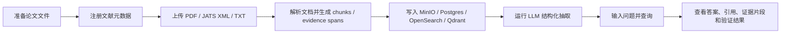

# Evidence Bio RAG 客户操作指南

本指南面向客户演示、内部试用和单机 Docker Compose 部署后的日常使用。系统的核心定位是“证据驱动的生物医学文献 RAG”：先导入论文，再解析和抽取证据，最后基于已导入证据回答问题，并给出可追溯的 `result_id` 和 `evidence_span_id`。

请不要把本系统描述为医学诊断工具。它是文献证据检索、结构化抽取、证据综合和研究辅助工具，关键结论仍应由研究人员复核。

## 访问入口

本地演示环境默认地址如下，正式交付时替换为部署域名。

| 功能 | 地址 |
| --- | --- |
| 前端页面 | http://127.0.0.1:3000 |
| 健康检查 | http://127.0.0.1:8000/health |
| MinIO 控制台 | http://127.0.0.1:9001 |
| OpenSearch | http://127.0.0.1:9200 |
| Qdrant | http://127.0.0.1:6333 |
| Neo4j Browser | http://127.0.0.1:7474 |
| GROBID | http://127.0.0.1:8070 |

第一版按私有/internal 部署处理，使用部署级 `X-API-Key` 控制访问，不包含多用户登录、多租户和计费。请只在可信网络中开放。

## 后台服务账号与用途

前端页面是客户日常使用入口；下面这些后台服务主要给部署方、运维或开发人员排查问题使用。

| 服务 | 是干什么的 | 账号密码 |
| --- | --- | --- |
| MinIO 控制台 | 查看上传的论文原文、解析 JSON、后续页面图片等对象存储文件 | 账号是 `.env` 的 `MINIO_ROOT_USER`，密码是 `.env` 的 `MINIO_ROOT_PASSWORD` |
| Neo4j Browser | 查看论文、研究、证据片段、结构化结果之间的图关系 | `.env` 的 `NEO4J_AUTH`，斜杠前是账号，斜杠后是密码，例如 `neo4j/your-secret` |
| GROBID | PDF 文献解析服务，后端会自动调用它解析 PDF | 不需要账号密码 |
| 前端 Runtime 里的 `X-API-Key` | 保护注册、上传、抽取、查询等业务 API | `.env` 的 `EBRAG_SECURITY__API_KEY`，它不是 MinIO/Neo4j/LLM 密钥 |

不要把 MinIO、Neo4j 或 LLM provider 的密钥填到前端 `X-API-Key` 输入框。客户只需要部署方提供的 `EBRAG_SECURITY__API_KEY`。

## API Key

`X-API-Key` 是本系统自己的部署访问口令，用来保护注册、上传、抽取、查询等业务 API。它不是 z.ai、OpenAI、Anthropic 或 Gemini 的 LLM API Key。

这串 Key 由部署方生成并写入服务器 `.env`，客户从部署方获取。部署方可以用 PowerShell 生成：

```powershell
$deploymentApiKey = [guid]::NewGuid().ToString("N")
$deploymentApiKey
```

然后把它写入 `.env`：

```env
EBRAG_SECURITY__API_KEY=上一步生成的部署访问Key
```

更新 `.env` 后重启 API 和前端：

```powershell
docker compose up -d --build api frontend
```

客户打开前端后，需要先在左侧 Runtime 区域填入部署方提供的这串 Key，再点击 `Save`。之后注册、上传、抽取和查询请求都会自动携带 `X-API-Key`。

命令行调用 API 时先准备请求头：

```powershell
$headers = @{ "X-API-Key" = $env:EBRAG_SECURITY__API_KEY }
```

如果命令行环境没有加载 `.env`，也可以直接填写部署访问 Key：

```powershell
$headers = @{ "X-API-Key" = "部署方提供的Key" }
```

## 使用总流程



客户可以把它理解成一个“先建库，再问库”的系统。没有导入文献时，系统不会凭空知道客户的私有资料。

## 准备材料

建议客户准备以下内容：

| 类型 | 说明 |
| --- | --- |
| 论文元数据 | 标题、DOI、PMID、PMCID、作者、年份、期刊、摘要、来源链接 |
| 原文文件 | 支持 `PDF`、`JATS_XML`、`TEXT` |
| 批量导入表 | 可选，CSV 一行一篇论文 |
| 研究问题 | 例如 `Does Compound X reduce IL-6 in mouse models?` |

解析质量优先级通常是：`JATS_XML` 优于结构清晰的 `PDF`，结构清晰的 `PDF` 优于扫描件。扫描件或复杂版式 PDF 可能需要额外 OCR/版面解析能力。

## 前端操作流程

打开前端地址后，按页面区域依次操作。

### 1. 注册文献

在文献注册区域填写论文信息，至少建议填写：

- `title`
- `doi` 或 `pmid` 或 `pmcid`，如果有
- `authors`
- `year`
- `journal`
- `abstract`
- `source_database`
- `source_url`

提交后系统会返回：

- `paper_id`：论文 ID
- `study_id`：研究 ID
- `report_id`：研究报告 ID
- `duplicate_kind`：如果命中去重，会显示重复类型

后续上传和抽取都围绕 `paper_id` 进行。

### 2. 上传原文

选择刚注册的 `paper_id`，上传 PDF、JATS XML 或 TXT。上传时需要选择 `source_format`：

| 格式 | 适用场景 |
| --- | --- |
| `JATS_XML` | PMC、期刊 XML、结构化全文 |
| `PDF` | 普通论文 PDF |
| `TEXT` | 纯文本、测试材料、已清洗全文 |

上传成功后，系统会自动完成：

- 原文写入 MinIO
- 文档解析
- 生成 chunks
- 生成 evidence spans
- 保存解析产物
- 写入 OpenSearch lexical index
- 写入 Qdrant vector collection

页面或接口会返回类似字段：

- `object_uri`
- `parsed_object_uri`
- `parsed_id`
- `chunk_count`
- `evidence_span_count`
- `lexical_documents`
- `vector_points`

正常情况下，`chunk_count` 和 `evidence_span_count` 应大于 0。

### 3. 运行结构化抽取

上传并解析完成后，点击抽取按钮。生产环境会调用已配置的真实 LLM provider，从 evidence spans 中抽取结构化结果。

抽取结果通常包含：

- `result_id`
- `paper_id`
- `study_id`
- `study_type`
- `intervention`
- `outcome`
- `direction`
- `scope`
- `effect_size`
- `p_value`
- `evidence_span_id`
- `extraction_status`

系统会在写库前检查 LLM 返回的 `paper_id`、`study_id` 和 `evidence_span_id` 是否真实存在。引用未知 evidence span 的结果不会写入有效结果表。

### 4. 输入问题查询

在查询区域输入问题。建议问题尽量具体，例如：

```text
Does Compound X reduce IL-6 in mouse models?
```

可以选择查询范围：

| `query_scope` | 含义 |
| --- | --- |
| `any` | 不限制范围 |
| `animal` | 只接受动物证据范围 |
| `in_vitro` | 只接受体外实验范围 |
| `human_clinical` | 只接受人体临床证据范围 |

查询结果重点查看这些字段：

| 字段 | 说明 |
| --- | --- |
| `answer` | 最终回答 |
| `sentences` | 分句回答 |
| `cited_result_ids` | 每句引用的结构化结果 |
| `cited_evidence_span_ids` | 每句引用的原文证据片段 |
| `sufficiency` | 证据是否充分 |
| `verification` | 引用、数字声明、LLM verifier 的验证结果 |
| `block_reasons` | 如果最终回答被阻断，会显示原因 |

客户应优先看答案背后的 evidence spans，而不是只看模型自然语言总结。

## 批量导入

当前版本已经具备后端 API，因此可以通过脚本进行批量导入。前端如果需要更友好的批量页面，可以作为后续交付功能扩展。

推荐批量导入格式为 CSV：

```csv
title,doi,pmid,pmcid,authors,year,journal,abstract,source_database,source_url,file_path,source_format
Compound X reduces IL-6,10.0000/demo-001,,,,2026,Local Test,Compound X reduced IL-6.,local,,C:\papers\compound-x.xml,JATS_XML
```

批量导入脚本应按以下顺序处理每一行：

1. 调用 `POST /papers/register` 注册论文
2. 读取返回的 `paper_id`
3. 调用 `POST /papers/{paper_id}/documents` 上传文件
4. 上传成功后记录 `chunk_count`、`evidence_span_count`
5. 调用 `POST /extraction/{paper_id}/run` 运行抽取
6. 记录成功/失败状态和错误原因

PowerShell 批量导入示例：

```powershell
$rows = Import-Csv ".\papers.csv"

foreach ($row in $rows) {
  $metadata = @{
    title = $row.title
    doi = if ($row.doi) { $row.doi } else { $null }
    pmid = if ($row.pmid) { $row.pmid } else { $null }
    pmcid = if ($row.pmcid) { $row.pmcid } else { $null }
    authors = if ($row.authors) { $row.authors -split ";" } else { @() }
    year = if ($row.year) { [int]$row.year } else { $null }
    journal = if ($row.journal) { $row.journal } else { $null }
    abstract = if ($row.abstract) { $row.abstract } else { $null }
    source_database = if ($row.source_database) { $row.source_database } else { "local" }
    source_url = if ($row.source_url) { $row.source_url } else { $null }
  } | ConvertTo-Json -Depth 5

  $registered = Invoke-RestMethod `
    -Uri "http://127.0.0.1:8000/papers/register" `
    -Method Post `
    -Headers $headers `
    -Body $metadata `
    -ContentType "application/json"

  $paperId = $registered.paper_id
  $form = @{
    source_format = $row.source_format
    document_id = [System.IO.Path]::GetFileName($row.file_path)
    file = Get-Item $row.file_path
  }

  $upload = Invoke-RestMethod `
    -Uri "http://127.0.0.1:8000/papers/$paperId/documents" `
    -Method Post `
    -Headers $headers `
    -Form $form

  $extract = Invoke-RestMethod `
    -Uri "http://127.0.0.1:8000/extraction/$paperId/run" `
    -Method Post `
    -Headers $headers `
    -Body "{}" `
    -ContentType "application/json"

  [PSCustomObject]@{
    paper_id = $paperId
    title = $row.title
    chunks = $upload.chunk_count
    spans = $upload.evidence_span_count
    extraction_status = $extract.extraction_status
  }
}
```

正式给客户交付时，建议补一个批量导入页面：

- CSV 上传
- ZIP 文件包上传
- 导入任务列表
- 成功/失败统计
- 失败原因下载
- 单篇重试
- 全量或按 `paper_id` 重建索引

## 线上导入

线上导入一般分为四类。当前核心系统已经具备文献注册、文件上传、解析、抽取和查询能力；外部数据源连接器可以按客户数据来源继续扩展。

| 来源 | 可导入内容 | 注意事项 |
| --- | --- | --- |
| PubMed / PMID | 标题、作者、期刊、年份、摘要、MeSH 等元数据 | PubMed 通常不直接提供全文 PDF |
| PMC / PMCID | 元数据、开放全文、JATS XML | 最适合自动解析 |
| DOI / Crossref | DOI 元数据 | 全文下载取决于出版社和客户授权 |
| 客户内部库 | S3、MinIO、NAS、SharePoint、数据库、对象存储 | 需要定制 connector 和权限策略 |

对客户可以这样说明：

> 当前系统可以通过 API 做批量导入。如果客户希望“输入 PMID/PMCID 自动抓全文”或“同步内部文档库”，可以增加线上导入 connector。第一优先级建议支持 PMID/PMCID 列表和 PMC Open Access JATS XML，因为这类数据结构最稳定，解析效果最好。

## 常用 API

注册论文：

```powershell
$paper = @{
  title = "Compound X reduces IL-6 in APP/PS1 mice"
  doi = "10.0000/example-001"
  authors = @("Li", "Wang")
  year = 2026
  journal = "Local Test"
  abstract = "Compound X reduced IL-6 in a mouse model."
  source_database = "local"
  source_url = "http://localhost/example"
} | ConvertTo-Json

Invoke-RestMethod `
  -Uri "http://127.0.0.1:8000/papers/register" `
  -Method Post `
  -Headers $headers `
  -Body $paper `
  -ContentType "application/json"
```

上传文件：

```powershell
$form = @{
  source_format = "JATS_XML"
  document_id = "sample.xml"
  file = Get-Item ".\sample.xml"
}

Invoke-RestMethod `
  -Uri "http://127.0.0.1:8000/papers/P00000001/documents" `
  -Method Post `
  -Headers $headers `
  -Form $form
```

运行抽取：

```powershell
Invoke-RestMethod `
  -Uri "http://127.0.0.1:8000/extraction/P00000001/run" `
  -Method Post `
  -Headers $headers `
  -Body "{}" `
  -ContentType "application/json"
```

查询完整回答：

```powershell
Invoke-RestMethod `
  -Uri "http://127.0.0.1:8000/query/full" `
  -Method Post `
  -Headers $headers `
  -Body '{"query":"Does Compound X reduce IL-6?","query_scope":"animal"}' `
  -ContentType "application/json"
```

重建索引：

```powershell
Invoke-RestMethod `
  -Uri "http://127.0.0.1:8000/index/rebuild" `
  -Method Post `
  -Headers $headers `
  -Body '{"paper_id":"P00000001"}' `
  -ContentType "application/json"
```

## 运维操作

在仓库根目录执行：

```powershell
cd "E:\super rag\evidence-bio-rag"
```

启动完整服务：

```powershell
docker compose up -d --build
```

查看服务状态：

```powershell
docker compose ps
```

查看 API 日志：

```powershell
docker compose logs api --tail=200
```

停止服务但保留数据卷：

```powershell
docker compose down
```

停止服务并删除数据卷：

```powershell
docker compose down -v
```

只重建 API：

```powershell
docker compose up -d --build api
```

## 配置与密钥

真实上线时，`.env` 至少需要配置：

```env
EBRAG_PROJECT__ENVIRONMENT=prod
EBRAG_SECURITY__API_KEY=your-deployment-api-key
EBRAG_LLM__PROVIDER=openai
EBRAG_LLM__API_KEY=your-api-key
EBRAG_LLM__MODEL=glm-5.1
EBRAG_LLM__BASE_URL=https://api.z.ai/api/coding/paas/v4
EBRAG_EMBEDDING__PROVIDER=sentence_transformers
EBRAG_EMBEDDING__MODEL=BAAI/bge-small-en-v1.5
EBRAG_VECTOR__COLLECTION=evidence_spans
```

注意：

- `.env` 不应提交到 GitHub。
- 生产环境不能使用 fake LLM 或 fake embedding。
- 部署 API Key 由部署方自行生成，用于访问本系统；LLM API Key 由模型供应商提供，用于调用模型。两类密钥不要混用。
- 轮换部署 API Key 时，重新生成 `EBRAG_SECURITY__API_KEY`，更新 `.env`，重启 `api frontend`，再把新 Key 发给客户。
- 如果部署到公网，必须额外加 HTTPS、防火墙和更细粒度的访问控制。

## 结果解读

### `sufficiency`

| 值 | 含义 |
| --- | --- |
| `sufficient` | 当前证据足以回答问题 |
| `partial` | 有部分证据，但不足以完整回答 |
| `insufficient` | 证据不足，系统应倾向拒答或提示不足 |

### `verification.verdict`

| 值 | 含义 |
| --- | --- |
| `supported` | 声明被证据支持 |
| `partially_supported` | 部分支持 |
| `unsupported` | 未被证据支持 |
| `contradicted` | 与证据矛盾 |
| `wrong_scope` | 证据范围不匹配，例如动物证据外推到临床 |
| `overgeneralized` | 结论过度泛化 |
| `uncited_numeric` | 数字声明没有在引用证据中出现 |

如果 `block_reasons` 不为空，说明最终回答被安全门阻断或需要谨慎处理。

## 常见问题

### 前端打不开

检查服务是否启动：

```powershell
docker compose ps
```

确认 `frontend` 服务端口是 `127.0.0.1:3000->80/tcp`。

### API 不健康

检查：

```powershell
Invoke-RestMethod http://127.0.0.1:8000/health
docker compose logs api --tail=200
```

常见原因包括数据库未启动、`.env` 配置错误、部署 API Key 缺失、LLM provider 缺少 API key。

### 上传后 evidence span 数量为 0

可能原因：

- 文件格式选择错误
- PDF 是扫描件或版式过复杂
- JATS XML 不符合预期结构
- 文本内容太短或没有可抽取段落

建议优先使用 JATS XML 或质量较好的文本型 PDF。

### 抽取失败

可能原因：

- LLM 返回 JSON 不符合 schema
- LLM 引用了不存在的 `evidence_span_id`
- provider API 超时或配额不足

系统会尽量拒绝无效结果，避免写入坏外键数据。

### 查询返回证据不足

这通常不是错误，而是系统没有在已导入文献中找到足够支持当前问题的证据。可以：

- 上传更多相关文献
- 放宽 `query_scope`
- 调整问题措辞
- 重建索引

### 首次查询很慢

首次运行真实 embedding 时，模型需要加载权重；首次 Docker build 也会下载较大的 ML 依赖。后续查询通常会更快。

## 交付验收清单

交付或演示前建议确认：

- `docker compose ps` 所有核心服务为 Up
- `GET /health` 返回 `{"status":"ok"}`
- 前端页面可打开
- 可以注册一篇论文
- 可以上传 JATS XML/PDF/TXT
- 上传后 `chunk_count > 0`
- 上传后 `evidence_span_count > 0`
- 抽取返回至少一个 result
- 查询返回 answer 和 citations
- `verification` 不为空
- GitHub CI 通过

## 推荐客户话术

> 这个系统不是普通聊天机器人，而是先把论文导入证据库，再从论文中抽取结构化证据，最后基于证据回答问题。每个回答都会尽量绑定到具体 result 和 evidence span。如果证据不足或范围不匹配，系统会提示不足或阻断，而不是强行生成结论。
